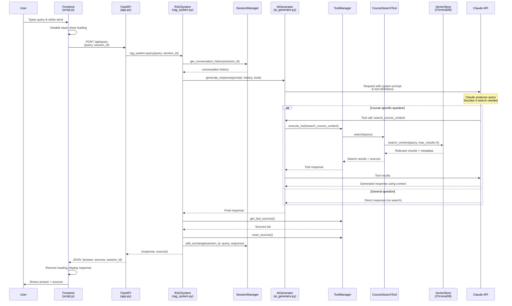

# RAG Chatbot Query Flow Diagram

## Flow Breakdown

### **Phase 1: User Interaction**
1. User types query in chat input
2. Frontend disables input, shows loading animation
3. Makes POST request to `/api/query` endpoint

### **Phase 2: API Processing**
4. FastAPI receives request, validates data
5. Creates/retrieves session ID
6. Calls RAG system for processing

### **Phase 3: RAG Orchestration**
7. RAG system retrieves conversation history
8. Prepares prompt for AI generator
9. Passes tools (search capabilities) to AI

### **Phase 4: AI Processing**
10. AI generator sends request to Claude API
11. Claude analyzes query type using system prompt
12. **Decision Point**: Course-specific vs general question

### **Phase 5A: Vector Search (if needed)**
13. Claude calls search tool via tool manager
14. CourseSearchTool queries ChromaDB vector store
15. Returns semantically similar course chunks
16. Claude synthesizes response using retrieved context

### **Phase 5B: Direct Response (if general)**
13. Claude answers directly without search

### **Phase 6: Response Assembly**
14. AI generator returns final response
15. RAG system extracts sources from tool usage
16. Updates conversation history for session
17. Returns response and sources

### **Phase 7: Frontend Display**
18. Frontend receives JSON response
19. Updates UI with AI answer and sources
20. Re-enables input for next query

## Key Components

- **Session Management**: Maintains conversation context
- **Tool-Augmented AI**: Claude decides when to search
- **Vector Search**: Semantic matching for relevant content
- **Source Attribution**: Tracks material references
- **Real-time UX**: Loading states and smooth interactions